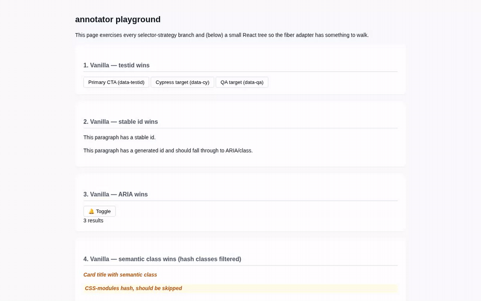

# annotator

**Click any element on a page → leave a comment → export.** Works on any HTML, anywhere.



[demo.mp4](./docs/demo.mp4) · [demo.webm](./docs/demo.webm)

---

## What it does

- **Click** any element on the page — the annotator picks the best stable selector for it (`data-testid` → ARIA → semantic class → ancestor-anchored fallback).
- **Comment** in the side panel.
- **Export** — markdown for Claude, JSON, GitHub issue body, Slack, or POST to your dev server. Clipboard, download, or HTTP.
- **React-aware** — when the page is React, captures the component name (`Cell`, `BudgetTable`), key props, and the JSX source location (`src/components/X.tsx:42:7`) from `fiber._debugSource`.

The point: you've spotted something off in your UI, you want a teammate (or Claude) to fix it. Don't paragraph-describe. Click the thing. Type the change. Send.

---

## How to use it (pick one)

### 1. Zero-touch, on a localhost dev server (any framework)

```sh
annotator dev http://localhost:5173
# → http://localhost:5800
```

A localhost proxy injects the overlay into HTML responses on the fly. **No files are written to your project.** Sessions land in `~/.annotator/<projectname>/<timestamp>.{json,md}` so an agent can read them without copy/paste.

### 2. Zero-touch, on any page in the world (paste-once)

```sh
annotator copy
```

Paste the contents into the devtools console of any page (your app in prod, a third-party site, anything). Floating "Annotate" button appears.

For repeatable use, `annotator bookmarklet` prints a `javascript:` URL — drag it to your bookmarks bar.

### 3. Embedded in a Vite project (one-time setup, zero-friction thereafter)

```sh
cd my-vite-app
annotator init
```

Adds `@rld/annotator/vite` to `vite.config.ts` (via `bun link`), `.annotator/` to `.gitignore`, and that's it. Auto-injects in dev (`vite serve`), absent from `vite build`. The "Send" button POSTs sessions straight to `<project>/.annotator/`.

### 4. Embedded in a static HTML project

```sh
cd my-static-site
annotator init
```

Symlinks the IIFE into the project and adds a `<script>` tag to your HTML.

---

## CLI reference

```
annotator dev <upstream>       Zero-touch localhost proxy (recommended)
annotator copy                 IIFE → clipboard (devtools paste)
annotator print                IIFE → stdout
annotator bookmarklet          javascript: URL bookmarklet
annotator path                 Absolute path to the IIFE bundle
annotator init [path]          Embed in a Vite or static project (writes files)
annotator build                Rebuild the IIFE bundle from source
annotator help
```

---

## What lands in the export

A markdown item looks like this when in verbose mode (best for handoff to Claude):

```md
## 2. Cell (col=cost, kind=number)

- **selector** (`ancestor-nth`): `#react-root div.budget > table > tbody > tr > td:nth-of-type(3)`
- **component**: App > BudgetTable > Row > Cell
- **source**: `src/components/BudgetTable.tsx:42:7`
- **preview**: > $205

Round to $200 — no cents on display.
```

The selector strategy adapts per element: a `[data-testid="primary-cta"]` produces `TESTID [data-testid="primary-cta"]`, an unlabeled cell produces an ancestor-anchored chain. You always get the most specific stable identifier available.

---

## Develop

```sh
bun install
bun run build       # → dist/{annotator.iife.js, index.js, vite.js}
bun run playground  # → http://localhost:5780 (test fixture, vanilla + React)
bun run demo        # re-record docs/demo.{webm,mp4,gif} via Playwright
bun run typecheck
```
